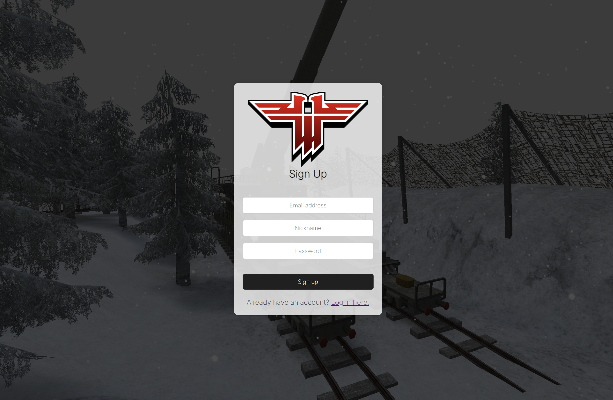

# Map Depot

## Table of content
- [App description](#app-description)
- [Tech stack](#tech-stack)
- [Database design and structure](#database-design-and-structure)
- [Installation](#installation)
- [Features](#features)
- [Screenshots](#screenshots)

## App description
Map Depot is an application that aggregates maps for computer games. Users can add, like, and download maps. Admins can also delete them, while guests can only browse and download. The application also allows for creating a new account, logging in, and changing the password.

## Tech stack
- Git
- Docker
- HTML
- CSS
- JavaScript
- PHP
- PostgreSQL

## Database design and structure
### ERD Diagram


### SQL dumps
- `db.sql` - Database schema, basic roles and users
- `db-schema.sql` - Database schema only

## Installation
### Requirements
- Docker

### Process of installation on Windows
```shell
# Clone repository
git clone https://github.com/tomkosdev/wdpai.git

# Go to project directory
cd wdpai

# Build docker images
docker compose build

# Run docker containers in the background
docker compose up -d

# Load SQL dump (e. g. `db.sql` - schema and basic data)
# On default settings
cat db.sql | docker compose exec -T db psql -U docker -d db

# Shut down docker containers after using
docker compose down

```

### Web application
- Go to location http://localhost:8080
- You can use application as unauthorized [Guest](#guest), however your possibilities will be limited
- Login using one of these credentials:
  - User with role [Admin](#admin):
    - Email: **admin@admin.pl**
    - Password: **admin**
  - User with role [User](#user):
    - Email: **user@user.pl**
    - Password: **user**
- Now you can do actions permitted for specific role

### pgAdmin
- Go to location http://localhost:5050
- Login using credentials (default ones):
  - Email Address / Username: **admin@admin.com**
  - Password: **admin**
- Register database server using *internal credentials* (default ones):
  - Host name/address: **db**
  - Port: **5432** (**5433** while accessing outside the containers)
  - Maintenance database: **db**
  - Username: **docker**
  - Password: **docker**
- Now you can manage the database


## Features
### Guest
- View all maps
- Search maps by title
- View detailed information
- Download maps
- Login
- Register

### User
- View all maps
- Search maps by title
- View detailed information
- Download maps
- Add maps to favourites
- Add maps to the databse
- Logout
- Change password


### Admin
- View all maps
- Search maps by title
- View detailed information
- Download maps
- Add maps to favourites
- Add maps to the databse
- Logout
- Change password
- Remove maps

## Screenshots
### Desktop - Main page

### Desktop - Add a map

### Desktop - Favourite maps

### Desktop - Change password

### Desktop - Login

### Desktop - Register


### Mobile - Main page

### Mobile - Add a map

### Mobile - Favourite maps

### Mobile - Change password

### Mobile - Login

### Mobile - Register

